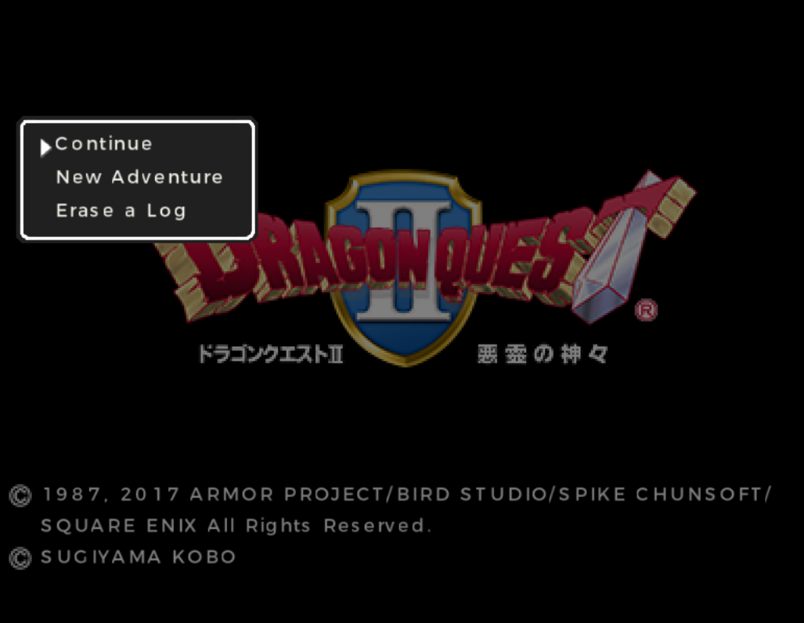
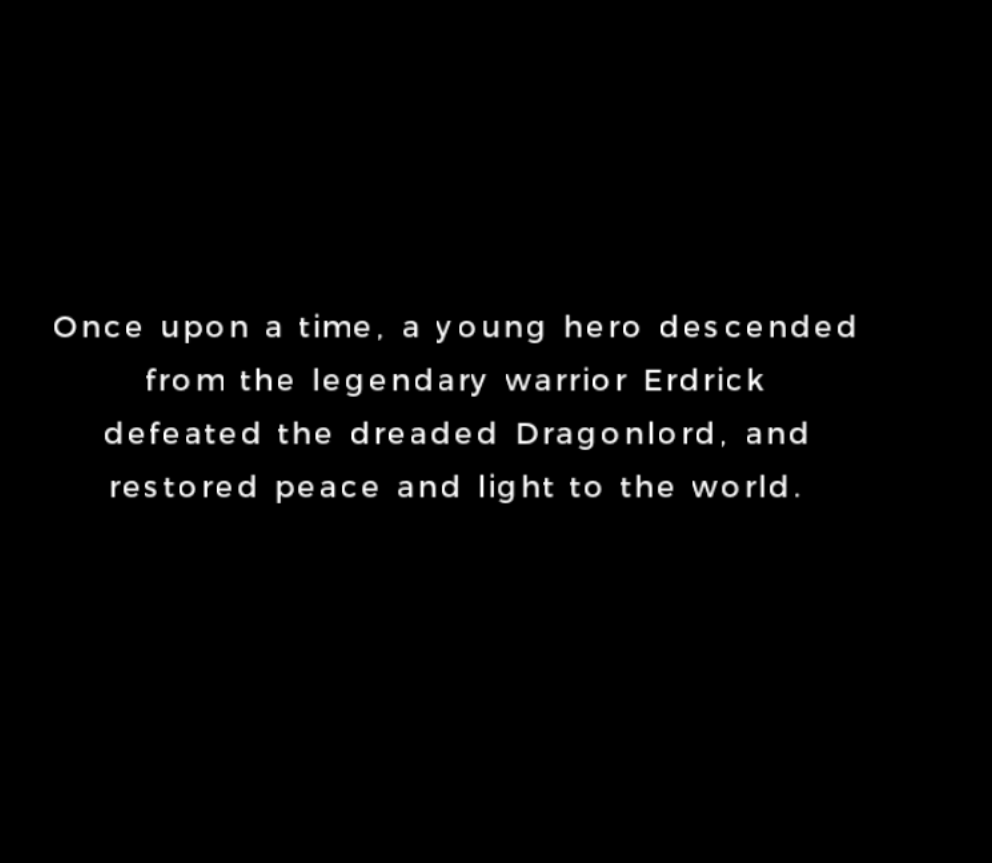
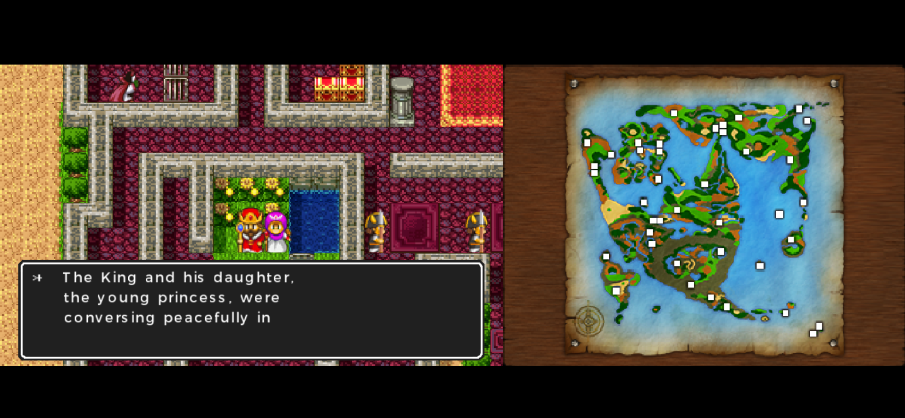
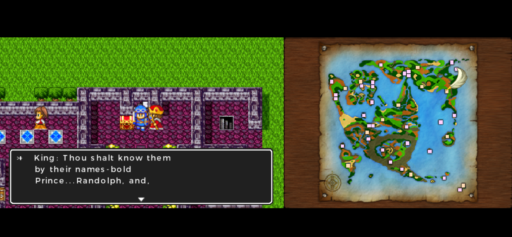
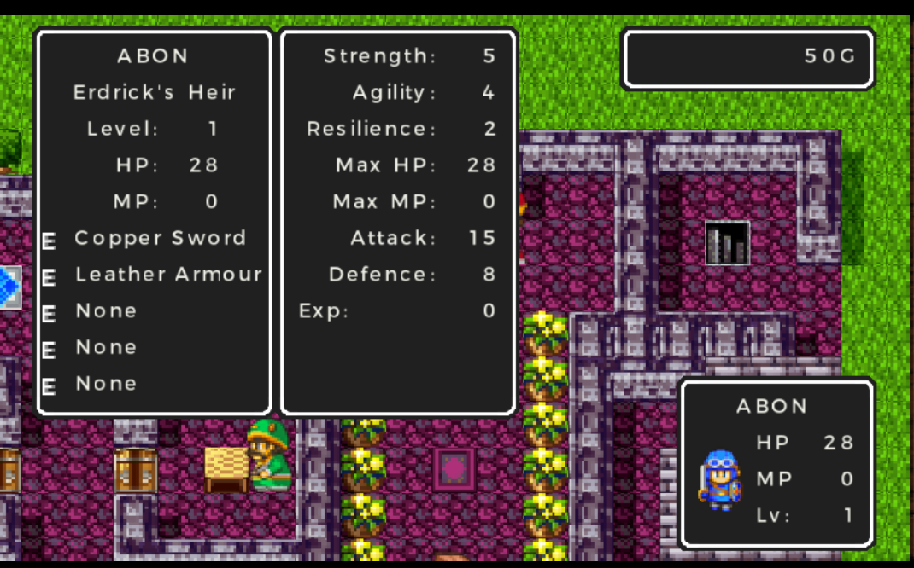
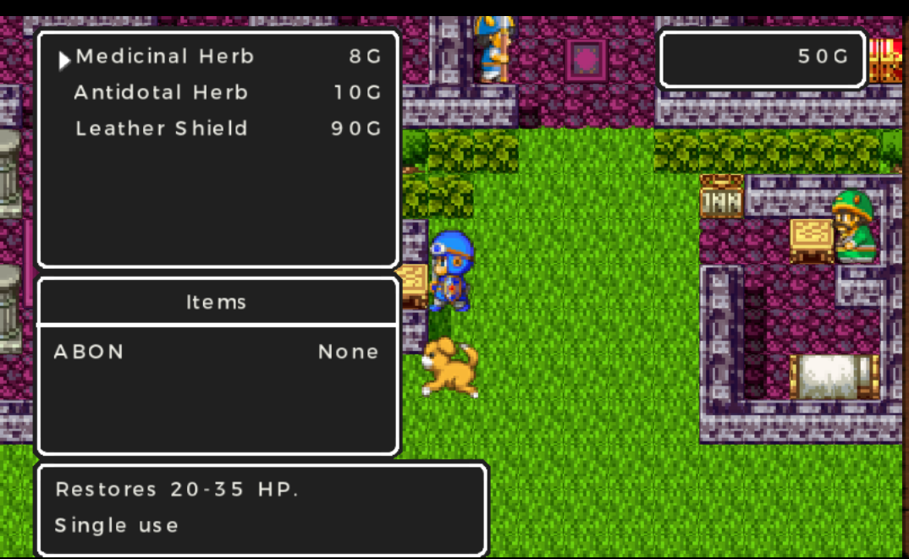
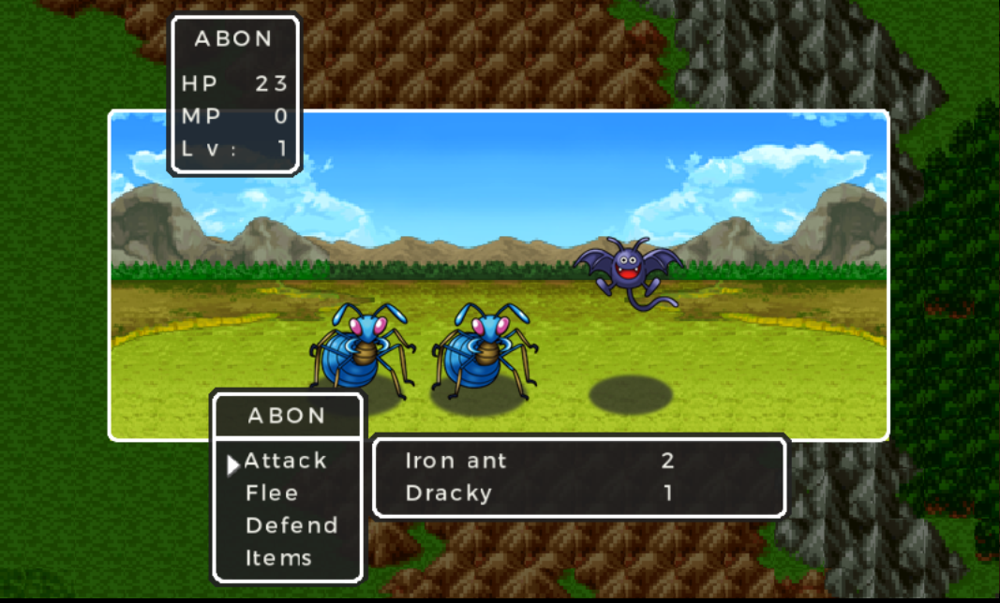
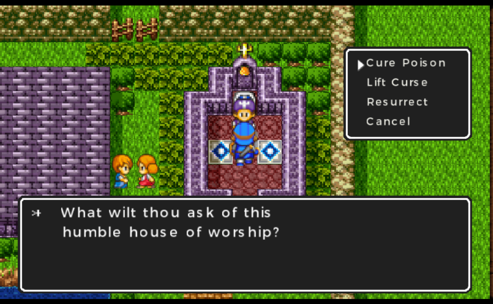
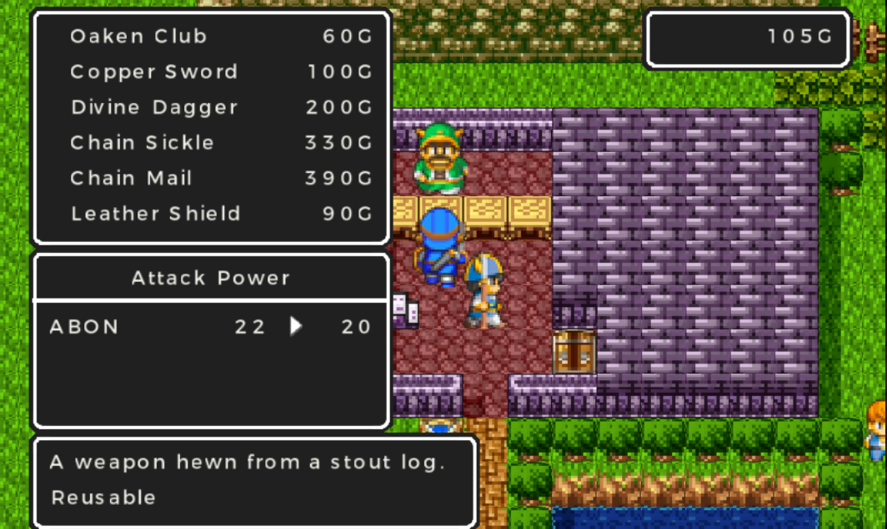
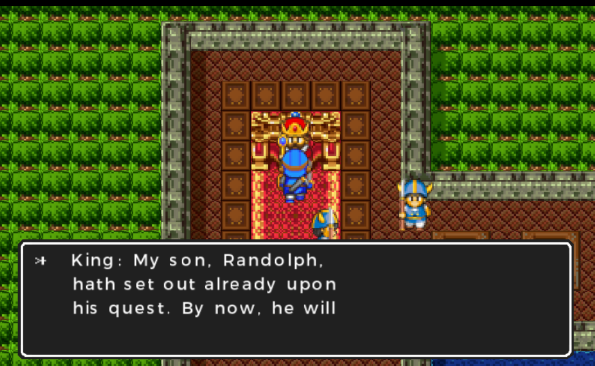

# Dragon Quest II: English Translation for Nintendo 3DS

An English patch for the Japanese Nintendo 3DS release of Dragon Quest II, assembled by TopCatHack (2026). It adapts the official English script from the Nintendo Switch version and translates the 3DS interface.

## Status

**Beta v0.90.** The opening narration and companion naming changes have been tested in Azahar. A full playthrough and testing on real Nintendo 3DS hardware remain pending.

## What is translated

Story dialogue, battle messages, item and equipment names and descriptions, menus, and the Adventure Guide. The four opening narration cards use the official English text, including Erdrick and Dragonlord terminology.

Name entry uses Latin characters. All eight possible default names for the Prince of Cannock and all eight for the Princess of Moonbrooke use their official English equivalents. Choosing No at the king's name-confirmation prompts allows custom Latin names of up to eight characters.

Default-name changes apply to new Adventure Logs. Names already stored in existing saves remain unchanged.

## Downloads and installation

[**Download the DQ2 English beta v0.90 patch**](https://github.com/topcatromhacking-lgtm/dragon-quest-2-3ds-english/releases/download/v0.90/DQ2_3DS_English_v0.90_Beta_TopCatHack.zip)

The ZIP includes detailed installation instructions in `README.txt`. You need your own copy of the Japanese Nintendo 3DS game. The same patch files work with Azahar and Luma3DS.

### Azahar

Stop the game and extract the patch ZIP. Right-click Dragon Quest II in the game list and open its Mods Location. Put `code.ips` directly in that folder and `retro2_res.dat` inside its `romfs` folder. Do not nest another Title ID folder inside the mods location.

```text
<Mods Location>/code.ips
<Mods Location>/romfs/retro2_res.dat
```

Launch the Japanese game normally.

### Luma3DS (Nintendo 3DS / 2DS)

With the console powered off, place the patch files on the SD card under the game's Title ID. Dragon Quest II's Japanese Title ID is `00040000001C3800`.

```text
SD:/luma/titles/00040000001C3800/code.ips
SD:/luma/titles/00040000001C3800/romfs/retro2_res.dat
```

Hold SELECT while powering on, enable **Enable game patching**, and save the configuration with START. Launch the installed Japanese game from the HOME Menu. Real hardware testing remains pending.

### Updating or disabling the patch

Stop the game before replacing files and back up your normal saves. Remove an old `code.bin` override from this game's patch folder before using `code.ips`. To disable the translation, move this game's `code.ips` and `romfs` folder out of the patch location.

### Package checksum

SHA-256 for `DQ2_3DS_English_v0.90_Beta_TopCatHack.zip`:

```text
f87c76bad089732aea1b21e188cfe20cecbab478d9f1d6c6d529f623a61abcdd
```

## Known issues and TODO

Some longer messages and descriptions may overflow or overlap. Japanese remains in the staff credits and the small title/subtitle graphic beneath the main logo. The script audit found no further Japanese narration cards, but a complete playthrough is still needed to check less frequently used screens and later-game behavior.

Complete playthrough testing, verify Luma3DS compatibility on real hardware, correct overflow and spacing, translate the remaining title graphic and staff credits, and finalize credits and release documentation.

## Screenshots

Screenshots from the DQ2 beta running in Azahar.

| Title menu | Opening narration |
| --- | --- |
|  |  |

| Dialogue and map | Companion names |
| --- | --- |
|  |  |

| Status and equipment | Item shop |
| --- | --- |
|  |  |

| Battle | Church |
| --- | --- |
|  |  |

| Equipment shop | Story dialogue |
| --- | --- |
|  |  |

## Reporting problems

[Open an issue](https://github.com/topcatromhacking-lgtm/dragon-quest-2-3ds-english/issues/new) with the patch version, location, steps to reproduce the problem, and a screenshot. For freezes, a normal in-game save made before the problem is especially helpful. When reporting naming problems, mention whether you used a new Adventure Log or an existing save.

## Credits

Assembly, interface translation, adaptation, and testing: TopCatHack (2026).

Original game and official English localization: Square Enix and the original development and localization teams.

AI assisted with technical analysis, patch development, and troubleshooting.

This is an unofficial fan project, distributed free of charge. It must not be sold. Dragon Quest belongs to its respective rights holders.
